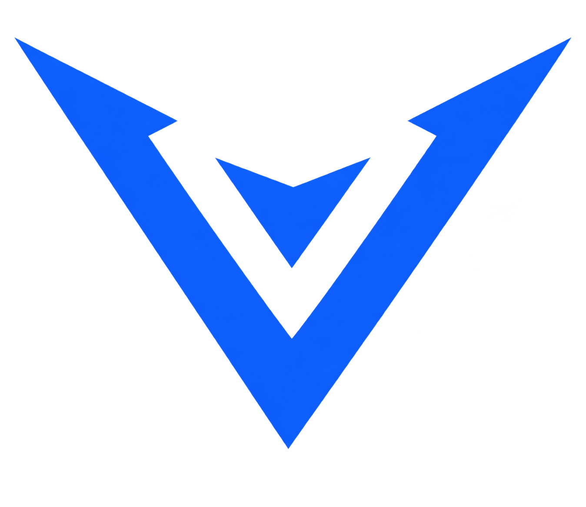
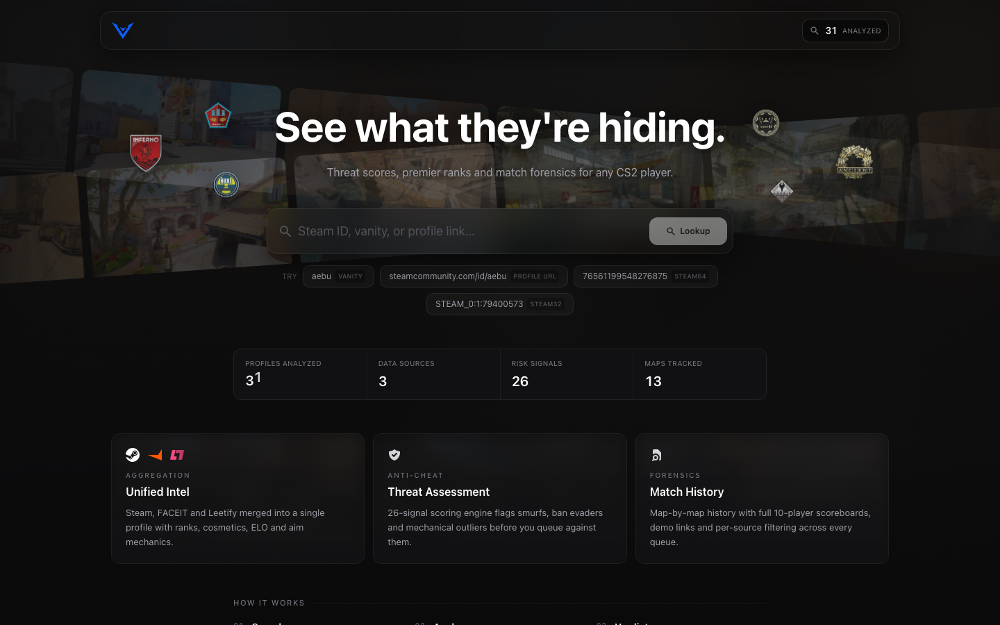
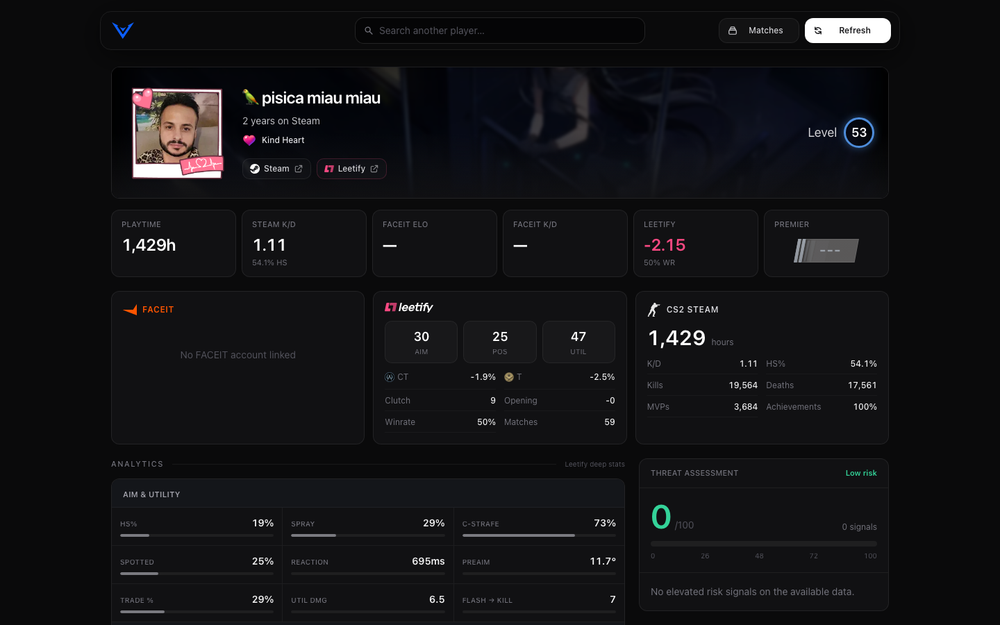
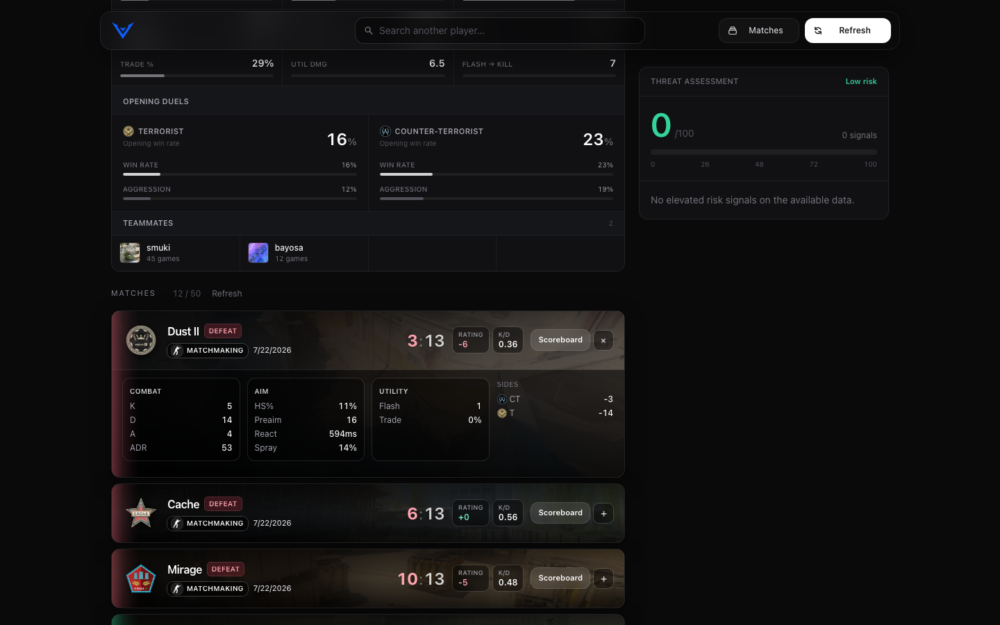
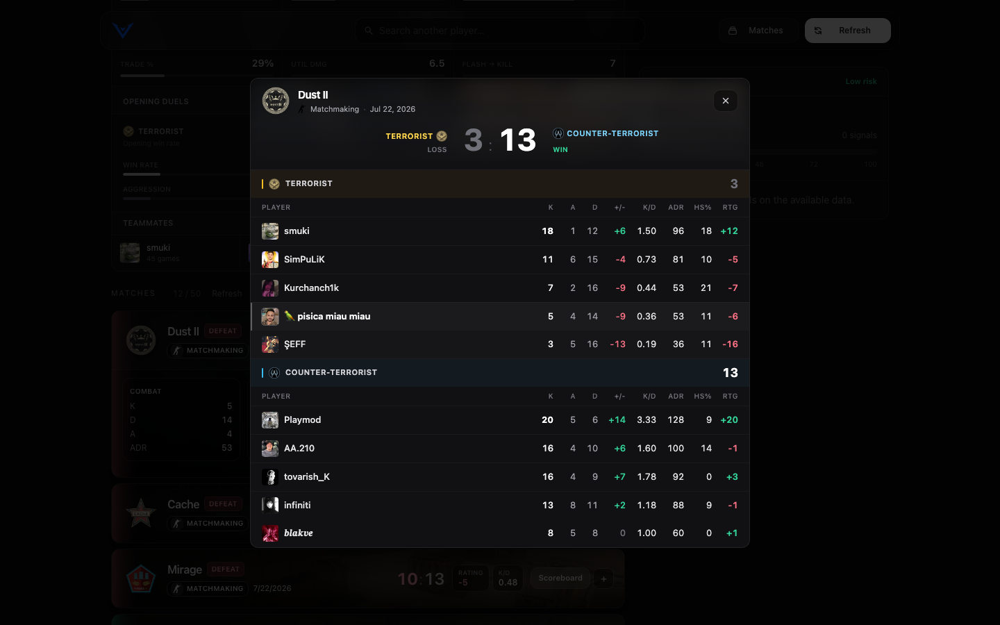
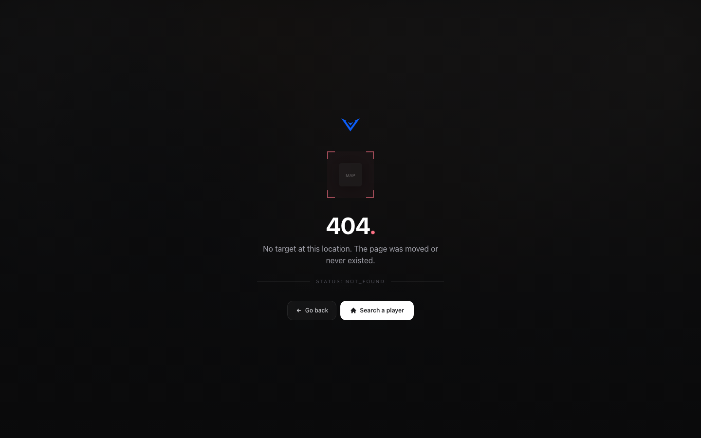

<p align="center">
  
</p>

<h3 align="center">See what they're hiding.</h3>

<p align="center">
  Real-time intelligence platform for Counter-Strike 2. One search merges
  <strong>Steam</strong>, <strong>FACEIT</strong> and <strong>Leetify</strong> into a single
  threat report: cosmetics, Premier CS Rating, deep aim analytics and full
  match forensics.
</p>

<p align="center">
  <a href="QUICKSTART.md">Quickstart</a>&nbsp;&nbsp;·&nbsp;&nbsp;
  <a href="docs/api.md">API Reference</a>&nbsp;&nbsp;·&nbsp;&nbsp;
  <a href="docs/risk-assessment.md">Threat Model</a>&nbsp;&nbsp;·&nbsp;&nbsp;
  <a href="docs/SECURITY.md">Security</a>
</p>

---

## Screenshots

| Home | Profile |
|:---:|:---:|
|  |  |

| Match history (expanded) | Scoreboard |
|:---:|:---:|
|  |  |



> Full-page profile shot: [`screenshots/profile-desktop.png`](screenshots/profile-desktop.png)

---

## What's inside

**Intel**
- **Universal lookup** - Steam profile URL, SteamID64, SteamID32 or vanity in one box
- **Threat assessment v2** - 26-signal soft-capped scoring engine with graduated weights, interaction bonuses across four risk families, and a ban floor so VAC or FACEIT bans never read as "low"
- **Premier CS Rating** - official tier banners (grey / light blue / blue / purple / pink / red / gold) with the number set inside, and a three-dash unrated plate
- **Steam cosmetics** - equipped profile wallpaper (animated or static) behind the hero, real avatar frame overlay, official level badge with per-band colors and 100+ sprite shapes, favorite badge with hover details
- **Deep analytics** - Leetify aim/utility mechanics, opening duels per side with T/CT faction icons, deduplicated so nothing renders twice

**Matches**
- **Unified history** - FACEIT and Valve queues merged, map-art backgrounds, soft win/loss dissolve edges, Load more pagination
- **CS2-style scoreboards** - 10-player tables, Counter-Terrorist / Terrorist headers, clickable names to Vantage profiles on both sources, avatars with letter-tile fallback
- **Correct results, verified** - FACEIT win detection via faction roster scan (the history API omits `playing_faction`), wingman and competitive demos resolved through source aliases, ELO deltas derived from match-to-match elo

**Platform**
- **Design system** - one dark visual language across home, profile, scoreboards, loading, error and 404 states; map-backed cards; mobile-first bottom sheets, safe areas and touch targets
- **Keep-fresh controls** - Refresh (10 min cooldown) and Matches-only refresh, cached in Redis for speed
- **Assets tooling** - `scripts/fetch-map-assets.mjs` to refresh map art, `scripts/take-screenshots.cjs` Playwright driver for the gallery above

---

## Architecture

```
vantage/
├── apps/
│   ├── web/            # Next.js 14 (Pages Router) frontend
│   │   └── public/     # maps, logos, premier banners, flags
│   └── api/            # Fastify backend + BullMQ worker
├── packages/
│   └── shared/         # types, ID resolver, threat calculator, level helpers
├── prisma/             # PostgreSQL schema
├── scripts/            # asset fetch + screenshot drivers
└── docker-compose.yml  # PostgreSQL 16 + Redis 7
```

| Layer | Technology |
|-------|-----------|
| Frontend | Next.js 14, React, TypeScript, Tailwind CSS, Framer Motion |
| Backend | Fastify, TypeScript, BullMQ |
| Database | PostgreSQL 16 (Prisma ORM) |
| Cache | Redis 7 (profiles, matches, rate limits) |
| Upstream | Steam Web API, FACEIT Data API v4, Leetify public API |

---

## Quick start

```bash
./setup.sh        # or: cp .env.example .env && npm run docker:up && npm run db:generate && npm run db:push
npm install
# add your keys to .env (Steam required, FACEIT + Leetify recommended)
npm run dev
```

- App: http://localhost:3000
- API: http://localhost:3001/health
- Full walkthrough: [QUICKSTART.md](QUICKSTART.md)

### API keys

| Key | Where | Notes |
|-----|-------|-------|
| `STEAM_API_KEY` | https://steamcommunity.com/dev/apikey | required |
| `FACEIT_API_KEY` | https://developers.faceit.com/ | optional, unlocks FACEIT card + history |
| `LEETIFY_API_KEY` | contact Leetify | optional, unlocks mechanics + Premier rank |

Keys live server-side only and are injected by the Next.js proxy. See
[docs/SECURITY.md](docs/SECURITY.md).

---

## Understanding the threat score

A 0-100 score built from weighted signals in four families
(Account, Mechanics, Performance, Behavioral), soft-capped so a few medium
flags never max the meter, with an interaction bonus when independent
families stack.

| Level | Score | Meaning |
|-------|-------|---------|
| Low | 0-25 | Few or mild signals |
| Medium | 26-47 | Notable concerns |
| High | 48-71 | Several strong signals |
| Critical | 72-100 | Severe stack (bans plus mechanics or smurf pattern) |

Active VAC or FACEIT bans can never score "low". Every flag explains itself
in the UI with the triggering value and its weight. Full breakdown:
[docs/risk-assessment.md](docs/risk-assessment.md).

---

## API

```http
GET  /api/profile/:id                        # any Steam ID format
POST /api/profile/:id/refresh                # 10 min cooldown
POST /api/profile/:id/refresh-matches
GET  /api/matches/:dataSource/:dataSourceId  # full scoreboard (aliases accepted)
```

```bash
curl http://localhost:3001/api/profile/aebu
```

Complete reference with response shapes and caching behavior:
[docs/api.md](docs/api.md).

---

## Documentation

- [QUICKSTART.md](QUICKSTART.md) - setup, commands, troubleshooting
- [docs/DEPLOY.md](docs/DEPLOY.md) - production deploy (Vercel + Fly + Neon + Upstash)
- [docs/api.md](docs/api.md) - REST reference
- [docs/risk-assessment.md](docs/risk-assessment.md) - threat model v2
- [docs/examples-sdks.md](docs/examples-sdks.md) - client examples
- [docs/SECURITY.md](docs/SECURITY.md) - key proxy architecture
- [docs/README.md](docs/README.md) - docs index

## License

MIT, with third-party asset and trademark notices. Counter-Strike 2,
Steam and all map artwork are property of Valve Corporation; FACEIT marks
belong to FACEIT Ltd; Leetify marks belong to Leetify AB. This project is
not affiliated with any of them. See [LICENSE](LICENSE).
